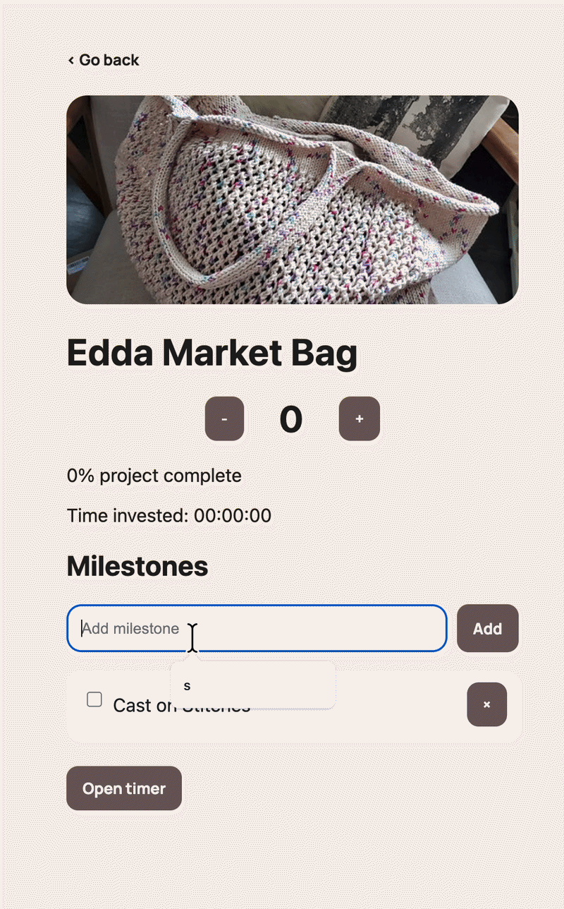
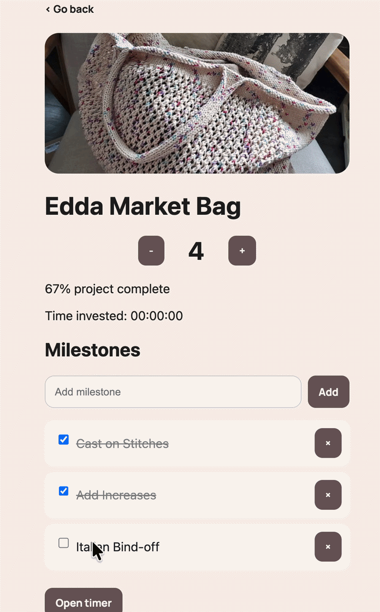

# knitTracker (Capacitor + Android)

This project explores how to use native Android features inside a web-based application using Capacitor.

---

## 🧠 Overview

**knitTracker** is a project-based time tracking app designed for knitting workflows.

Built with a web stack (Vite + JavaScript) and wrapped as a native Android app using Capacitor, it allows access to device features such as haptics and storage.

### Key features

- Project-based organization
- Milestone tracking
- Time tracking per project
- Progress visualization (%)
- Positive feedback system (celebration messages)

---

## 📱 Capacitor Usage

- Web app converted into Android app using Capacitor
- Haptics plugin adds vibration feedback
- LocalStorage used for persistence
- Real device testing required for full haptics support

---

## ⚡ Challenges & Learnings

- **Manual navigation architecture**  
  No routing library was used, requiring custom screen/state handling.

- **UI state management (CSS + JS)**  
  Synchronizing visual states with logic required careful coordination.

- **Capacitor workflow complexity**  
  Understanding the build → sync → run cycle was key.

- **Platform limitations**  
  Emulator support for haptics is inconsistent, requiring real device testing.

- **Data persistence decisions**  
  Using localStorage simplified implementation but limits scalability.

- **UX design evolution**  
  The app evolved from a simple timer into a structured project-based system.

---

## 🎨 Initial Concept

These sketches show the early interface ideas before implementation.


---

## 🚀 How to Use

### Step 1 — Create a project

<p align="center">
  
</p>

---

### Step 2 — Add milestones

<p align="center">
  
</p>

---

### Step 3 — Track time

<p align="center">
  
</p>

---

## 🇪🇸 Versión en Español (completa)

<details>
<summary><strong>Ver versión en Español</strong></summary>

### 🧠 Descripción general

KnitTracker es una aplicación para gestionar proyectos de tejido.

Permite:

- Crear proyectos
- Definir milestones
- Medir el tiempo invertido
- Visualizar el progreso

Incluye refuerzos positivos mediante mensajes celebratorios al completar objetivos.

---

### 💡 Proceso de ideación

La app nace como una herramienta para ayudar a tejedoras a organizar su tiempo en múltiples proyectos simultáneamente.

Permite:

- Registrar en qué parte del proyecto estás
- Medir tiempo dedicado
- Visualizar progreso en porcentaje
- Mantener motivación mediante feedback positivo

---

### 🧱 Estructura del proyecto

project-folder/
│
├── src/
│ ├── assets/
│ │ ├── images/
│ │ ├── fonts/
│ │ └── sounds/
│ │
│ ├── main.js
│ ├── style.css
│ └── sketch.js
│
├── index.html
├── package.json
├── vite.config.js
│
├── dist/
├── android/
└── README.md

---

### 📦 Dependencias principales

```json
{
  "@capacitor/core": "^5.x",
  "@capacitor/cli": "^5.x",
  "@capacitor/haptics": "^5.x",
  "p5": "^1.9.x"
}

🔢 Versiones
Node.js: v18+
npm: v9+
Vite: ^5.x
Capacitor: ^5.x
Android Studio: Flamingo o superior
Android SDK: API 33 / 34

</details>

<details> <summary><strong>Project Explanation (English)</strong></summary>

Concept

KnitTracker is a productivity app tailored for knitting workflows.

It enables users to manage multiple projects simultaneously by combining:

structured milestones
time tracking
progress visualization
Core idea

The goal is to centralize project tracking into a single interface where users can:

log their progress
track time spent
stay motivated through feedback
Technical approach
Built with Vite + JavaScript
Wrapped using Capacitor
Uses LocalStorage for persistence
Integrates native features (Haptics)
Design evolution

The app evolved from:
➡️ a simple timer
➡️ into a structured project management tool

This required rethinking:

navigation
data structure
user flow
</details>

## Challenges 

## ⚡ Challenges & Learnings

Working on this project helped me understand the differences between building a web app and turning it into a native Android application. One of the main challenges was getting familiar with the Capacitor workflow, especially the need to build, sync, and run the project outside the browser to see changes reflected on the device.

Another challenge was working with native features like haptic feedback. Testing this functionality showed the limitations of emulators, which made it necessary to use a real device to properly verify the experience.

Handling data with localStorage also required attention, particularly making sure that project information, progress, and time tracking stayed consistent across sessions.

Overall, the project evolved from a simple timer into a more structured tool, which led me to rethink the user flow and focus on keeping the app both functional and easy to use. It also helped me understand the importance of small UX details, such as providing feedback to the user through visual progress and simple interactions.

## How to run the App

Install dependecies

‘npm install‘

Build the App

‘npm run build‘

Sync with Android

‘npx cap sync android‘


Open in Android Studio

‘npx cap open android‘

Run the app

Open Android Studio
Start an emulator (Device Manager)
on Device Manager I chose Pixel 5 API 33 / 34
Click Run ▶️


📝 Notes
Haptics work best on real devices
Emulator behavior may vary
Always rebuild before syncing
```


## 📚 References & Learning Resources

This project was developed by combining official documentation and practical tutorials.

### 📖 Official Documentation

- Capacitor Documentation  
  https://capacitorjs.com/docs

- Capacitor Haptics API  
  https://capacitorjs.com/docs/apis/haptics

- Vite Documentation  
  https://vitejs.dev/guide/

- Android Studio Documentation  
  https://developer.android.com/studio

- Web Storage API (localStorage)  
  https://developer.mozilla.org/en-US/docs/Web/API/Window/localStorage

---

### Video Resources

- "Capacitor Crash Course"  
  https://www.youtube.com/watch?v=4n6X9y6Zy6Q

- "Build Android Apps with Capacitor"  
  https://www.youtube.com/watch?v=8s3vP3k5s0E

- "Vite JS Crash Course"  
  https://www.youtube.com/watch?v=KCrXgy8qtjM

- "Understanding localStorage in JavaScript"  
  https://www.youtube.com/watch?v=GihQAC1I39Q

---

### Additional Learning

- Experimentation with native features through Capacitor plugins  
- Testing differences between emulator and real devices  
- Iterative UI design and UX improvements  

---

### ⚠️ Note

This project was built as a learning exercise to understand how web applications can be extended with native mobile capabilities.